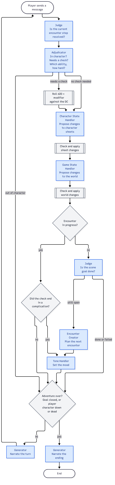

# Tabletop Roleplaying Game (TTRPG)

This is a minimal tabletop roleplaying game implementation. If you're familiar with [Dungeons and Dragons](https://en.wikipedia.org/wiki/Dungeons_%26_Dragons), then you might be familiar with some of the mechanics of this game. Instead of individually programming each rule, we rely on LLMs to interpret rules and update the game state. 

## Running

Every actor but the Generator must reply in JSON, so the `mock` pipeline can't run this scenario; use a real model. From the repository root:

```bash
python -m fictive.web --scenario examples/ttrpg --pipeline-type openai --model <provider/model>
```

See `ui/README.md` for running the web UI alongside it.

To keep it simple, instead of making a full tabletop RPG, we will have a very simple character sheet and ruleset. Unless otherwise specified, the mechanics around ability modifiers, Life Points (i.e: HP) and ability checks are the same as in Dungeons and Dragons. If you're not familiar with that game, the full set of rules for our minimal text-based tabletop game is here: [GAMEPLAY.md](docs/GAMEPLAY.md).

## Characters

Each character is a human that has three ability modifiers:
- **Strength**
- **Knowledge**
- **Mana**

Each ability modifier is assigned a number between +5 and -5. 

Each character also has a set of Life Points (LP). In this game, all characters start with a total of 20 Life Points.

[character_sheets.json](character_sheets.json) holds the character sheet of every character in the adventure, keyed by sheet id: the player character, NPCs and monsters too. Only the player character sheet is visible to the player.

[!TODO: generate a diagram of a character sheet- three stats and life points- based on the character `Mira` below]

```json
{
  "mira": {
    "name": "Mira", "kind": "pc", "unique": true,
    "abilities": {"strength": 1, "knowledge": 3, "mana": -1},
    "description": "A graduate student in her thirties with an axe she barely knows how to use.",
    "visible": true
  },
  "hooded_man": {
    "name": "The Hooded Man", "kind": "npc", "unique": true,
    "abilities": {"strength": -1, "knowledge": 4, "mana": 2},
    "description": "A hooded figure occasionally visible among the shadows.",
    "secrets": "He died here a century ago and cannot leave the crypt.",
    "visible": false
  },
  "undead_kobold": {
    "name": "Undead Kobold", "kind": "monster", "unique": false,
    "abilities": {"strength": 3, "knowledge": -4, "mana": 0},
    "description": "A reanimated humanoid lizard-like creature with a fell light in its eyes. .",
    "visible": false
  }
}
```

Each entry has:

- `name`: the character's display name.
- `kind`: `pc`, `npc` or `monster`.
- `unique`: whether the character can be in play only once. A named NPC is unique; a monster type can be brought in several times.
- `abilities`: the three ability modifiers, each between +5 and -5.
- `description`: what the player character can perceive about the character.
- `secrets` (optional): what only the game master knows. The Generator never sees it.
- `visible`: whether the character's sheet starts out visible to the player.

Every character starts with 20 Life Points, so the character sheets file doesn't list them.

## Adventure

The game master sets a premise and the overall goal of the adventure, along with some other details, in the `adventure.json` file. [! TODO: link to the `adventure.json` file.]

```json
{
  "premise": "An ancient evil lies sleeping beneath a sleepy island town. The forest that covers the southernmost shore of the island is rumored to be the entrance to a sealed tomb. Mira, a graduate student doing her doctoral thesis on pre-historic undead entities, has travelled to the forest hoping to get an interview.",
  "scene_goal": "Find and enter the pre-historic tomb.",
  "criteria": "Successfully reach the location: pre-historic tomb.",
  "player_character": "Mira",
  "start_location": "enchanted_forest",
  "flags": {
    "gate_closed": {"initial": false, "description": "The heavy wooden gate leading into the town from the forest is closed."},
    "noticed": {"initial": false, "description": "Mira has been noticed by the forest's inhabitants."}
  }
}
```

**Flags** are the facts about the world that can change during play. Each is true or false, with an initial value and a description of what it means. Only flags declared here exist.

The game master also defines a list of locations in [locations.json](locations.json), so the game only moves within a set list of locations. However, the LLM has a lot of latitude in deciding what happens within a location.

Each location has:

- `name`: the location's display name.
- `description`: what the player character finds there.
- `exits`: the ids of the locations it connects to. Exits are the ordinary ways between locations, not the only ones: see [Game State Handler](docs/ACTORS.md#game-state-handler).

```json
{
  "enchanted_forest": {
    "name": "Enchanted Forest",
    "description": "A small forest on the southern shore of the island, full of dark trees and mysterious glows.",
    "exits": ["forest_borders", "tomb_entrance"]
  },
  "tomb": {
    "name": "Tomb",
    "description": "UNKNOWN",
    "exits": ["tomb_entrance"]
  }
}
```
Along the way to the goal, the player character should have `encounters`- attacks or interactions with hostilie entities. 

## Actors

A game master does several sub-tasks at once- they decide the environment and NPC actions based on the player's actions; they set the mood, and they tell the story. The game master and players also keep track of their respective character's/non-player characters' stats. 

In this implementation, each of those sub-tasks gets its own agent- we call it an `Actor`.

An `Actor` is an LLM instance with its own conversation memory and chain-of-thought. Think of an `Actor` as one participant in a group project. Each participant has its own style of thinking and its own slice of the conversation, and takes part in the larger dialogue of the group. Only the main `generator` speaks to the human player; every other actor works behind the scenes.

Our current scenario has seven actors, plus the player:

[!TODO: have a visual representation of the actors + the player here]

1. The **Judge** checks whether the current encounter step is resolved.
2. The **Adjudicator** decides whether the message needs a check, and if so, which ability and difficulty tier apply.
3. If there is a check, code rolls it and works out the result.
4. The **Character State Handler** updates the character sheets of everyone the action affected.
5. The **Game State Handler** updates the state of the world.
6. If no encounter is in progress, the **Encounter Creator** starts the next one.
7. If an encounter just started, or the check ended in a complication, the **Tone Handler** sets the tone.
8. The **Generator** narrates what happened.

## Flows

A **flow** is a Python function that takes the runtime as its first argument. Flows are where actor behaviour is defined- who the actor talks to, how it takes player input, setting system prompts, among other things. Think of a **flow** as a 'script' for the `Actor`s. 

For example, here is the Generator's flow:

```python
def play(runtime):
    """Set up the adventure (unless resuming), then trade turns with the player until it ends."""
    # Read adventure.json, character_sheets.json and locations.json into one dict.
    adv = state.load_adventure()
    # RESUMED_STORE_KEY is set when a saved session is resumed, or a message is rewritten or forked.
    # Only a brand-new game needs setting up.
    if not runtime.store_get(RESUMED_STORE_KEY):
        # Set the Generator's system prompt and the starting state, plan the first encounter,
        # and narrate the opening.
        yield from begin(runtime, adv)
    # Each pass of this loop is one turn.
    while True:
        # Pause the flow until the player sends a message. The message is saved in the store
        # (for the Adjudicator) and in the Generator's history (for the narration).
        # content=False: "you> " is only an input cue, so the web UI doesn't show it as a message.
        message = yield from ask(runtime, "you> ", store=config.LAST_MESSAGE_KEY, history=True, content=False)
        # Play out the turn: the other actors judge, rule and update the game state,
        # and code rolls any check. Returns notes telling the narrator what happened.
        notes = yield from take_turn(runtime, adv, message)
        # Instructions for the ending if this turn ended the adventure (goal done or failed,
        # or the player character down or dead); None otherwise.
        ending = ending_note(runtime, adv)
        if ending:
            # The adventure is over: narrate the ending instead of the turn, and end the flow.
            narrate(runtime, adv, [ending])
            return
        # The adventure goes on: the Generator narrates this turn to the player.
        narrate(runtime, adv, notes)
```

### How The Gameplay Works

Each time the player sends a message:

1. The **Judge** checks whether the current encounter step is resolved.
2. The **Adjudicator** decides whether the message needs a check, and if so, which ability and difficulty tier apply.
3. If there is a check, code rolls it and works out the result.
4. The **Character State Handler** updates the character sheets of everyone the action affected.
5. The **Game State Handler** updates the state of the world.
6. If no encounter is in progress, the **Encounter Creator** starts the next one.
7. If an encounter just started, or the check ended in a complication, the **Tone Handler** sets the tone.
8. The **Generator** narrates what happened.

Each of these steps happens within a **flow**.

The diagram below shows one whole turn. Blue boxes are LLM actors; grey boxes are plain code. Its source is [actors.mmd](docs/actors.mmd); after editing it, re-render with `mmdc -i docs/actors.mmd -o docs/actors.png -b white -s 2` ([mermaid-cli](https://github.com/mermaid-js/mermaid-cli)).



What each actor sees, and what it returns, is described in [ACTORS.md](docs/ACTORS.md).

## State

The game has three kinds of state:

- the **adventure file**, the **character sheets file** and the **locations file**, written in advance and never changed during play
- the **live character sheets** of the characters in play, kept by the Character State Handler
- the **game state**, kept by the Game State Handler

Items and inventory are left out for now.

### Live Character Sheets

When a character enters play, a live character sheet is made from its character sheet. A unique character keeps its sheet id (`hooded_man`); each copy of a non-unique one is numbered (`undead_kobold_1`, `undead_kobold_2`).

```json
{
  "id": "undead_kobold_1",
  "sheet_id": "undead_kobold",
  "lp": 14,
  "status": "active",
  "conditions": ["grappling mira"],
  "disposition": "hostile",
  "visible": false,
  "notes": ["Lost an arm to Mira's axe."]
}
```

Fixed for the character's time in play:

- `id`: the character's id in play.
- `sheet_id`: the character sheet it was made from. Its name, kind, abilities, description and secrets are read from there.

Changed during play:

- `lp`: Life Points, between 0 and 20.
- `status`: `active`, `down`, `dead` or `fled`.
- `conditions`: short tags for temporary states, such as `soaked` or `grappling mira`.
- `disposition`: `hostile`, `neutral` or `friendly` toward the player character.
- `visible`: whether the player can see this sheet.
- `notes`: a running log of what has happened to the character.

### Game State

```json
{
  "location": "flooded_nave",
  "present": ["mira", "ferryman", "drowned_dead_1"],
  "flags": {"bridge_collapsed": true, "ferryman_paid": false},
  "encounter": "g12",
  "revealed": ["The relic lies in the lower vault."],
  "moves": [
    {"from": "crypt_entrance", "to": "flooded_nave", "via": "Walked down the steps into the water."},
    {"from": "flooded_nave", "to": "lower_vault", "via": "Smashed through the rotten vault door: Strength check, success."}
  ]
}
```

- `location`: the player character's current location.
- `present`: the characters in the scene. Only their sheets are shown to the Character State Handler, and only they can be described by the Generator.
- `flags`: the current value of every declared flag.
- `encounter`: the id of the encounter in progress, in the goal tree. The encounter's progress is kept in the goal tree, not here.
- `revealed`: facts the player has learned.
- `moves`: every move the player character has made: where from, where to, and how.

The Encounter Creator adds characters to `present` when it starts an encounter. The Game State Handler adds and removes them as the story moves: someone flees, or the player character leaves a location without them.

### Changes

Neither state handler rewrites its state. Each returns a list of proposed changes; code checks every change and applies the valid ones. An invalid change is dropped and logged, and the rest still apply.

The Character State Handler returns changes like:

```json
{"changes": [
  {"character": "drowned_dead_1", "lp": -5, "reason": "Mira's axe, strong success"},
  {"character": "mira", "add_condition": "soaked"},
  {"character": "ferryman", "disposition": "friendly"},
  {"character": "drowned_dead_1", "visible": true, "reason": "Knowledge check, success"}
]}
```

and the Game State Handler returns changes like:

```json
{"changes": [
  {"move_to": "lower_vault", "via": "Smashed through the rotten vault door: Strength check, success."},
  {"set_flag": "bridge_collapsed", "value": true},
  {"reveal": "The Ferryman cannot leave the crypt."},
  {"leave": "drowned_dead_1"}
]}
```

Code enforces the rules:

- A change may only target a character in `present`.
- Fields that come from the character sheets file can't be changed.
- Life Points stay between 0 and 20, and a character whose Life Points reach 0 becomes `down`.
- The player character can only move to a location declared in the locations file, and every move is recorded in `moves`.
- Only declared flags can be set.

Both live states are kept in the interpreter's store as JSON, so saving, rewriting and forking a session carry them along with everything else.

## Files

[docs/TUTORIAL.md](docs/TUTORIAL.md) explains actors and flows, and walks through how this scenario is built from them.

- `fictive_scenario.py`: the contract the web backend reads (main actor, actor types, entry flow, slash commands).
- `config.py`: paths, the game's constants, the actor list, and prompt lookup.
- `adventure.json`: the adventure.
- `character_sheets.json`: the adventure's character sheets.
- `locations.json`: the adventure's locations.
- `rules.py`: rolling a check and working out its result.
- `state.py`: loading the adventure, character sheets and locations files, and the live character sheets and game state kept in the store.
- `changes.py`: checking and applying the state handlers' proposed changes, and describing them to the Generator.
- `encounters.py`: encounters and their steps in the goal tree.
- `special_commands.py`: `/help`, `/save`, `/load`, `/list`, `/quit`, `/sheet`, `/where` and `/dc`.
- `flows/<actor>/`: each actor's flows. `flows/generator/` holds `play`, the entry flow; `flows/common.py` holds helpers the sub-actors share.
- `prompts/<actor>/<actor>_<key>.txt`: each actor's system prompt and task prompt templates.
- `docs/`: [GAMEPLAY.md](docs/GAMEPLAY.md) (the full rules), [ACTORS.md](docs/ACTORS.md) (what each actor sees and returns), [TUTORIAL.md](docs/TUTORIAL.md), and `actors.mmd` and `actors.png`, the turn's control diagram (see [How The Gameplay Works](#how-the-gameplay-works)) and its rendered image.

